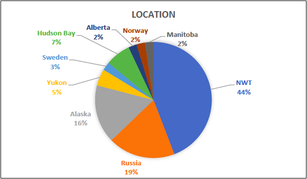
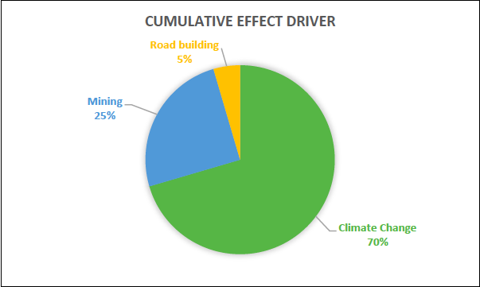
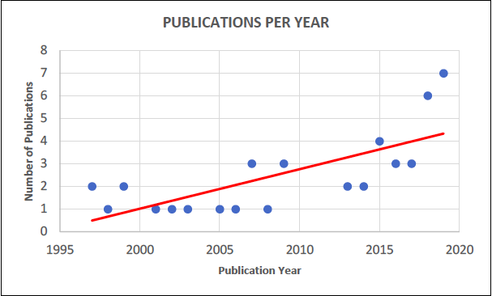
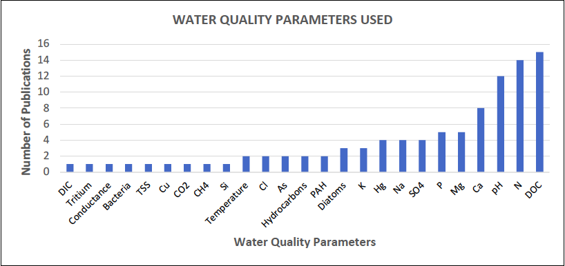

---
---
# 1.0. Chapter 1 -  Literature review of (cumulative) impacts from disturbances on water quality in the Upper Coppermine and similar ecoregions.

**1.1. Summary**

A systematic literature review was conducted in order to collate the existing literature and determine the current understanding regarding cumulative impacts to water quality in the Upper Coppermine. Results show that there is no existing peer-reviewed literature on cumulative impacts to water quality in the Coppermine River basin in the Web of Science database. Thus, the results highlight the need for more research in this area. A broad search that encompassed similar ecozones to the Upper Coppermine and a wide range of impacts returned 42 results. The majority of those publications focus on effects from climate change such as permafrost thaw. A small proportion of studies report effects due to mining and road building. Future monitoring strategies should pay attention to increases in major ions, DOC and pH in surface waters, which have been shown to arise as a result of permafrost slumping in the basin. Further, increases in conductivity might indicate impacts from road building and/or mining, while increases in strontium may signify diamond mine effluent.

**1.2. Methodology**

The systematic literature review approach was adopted from Moore et al. (2014) in order to efficiently collect, evaluate and synthesize literature specifically pertaining to the research topic. Web of Science was chosen as the database to search because of its robust archive of natural science journals. The database was accessed through the University of Saskatchewan’s library license. Only online available journal articles, published in the English language between 1900 and the present day, were included in the systemic literature review (Appendix A). However, insights from grey literature, such as government reports, are used in this report to discuss current understanding and aid in interpreting data.

To carry out the systematic search, three search categories were determined that represent the scope of the research project. These three themes are: 1) ‘Water Quality’; 2) ‘Location’; and 3) ‘Impacts’. Search terms, ranging from specific to broad, were drafted under each of these themes (Table 1-3). The systematic search of Web of Science yields papers that contain at least one search term in the title, abstract or keyword section of the paper from each of the three categories.

As a first step, an advanced search was carried out using search terms that are localised to the Upper Coppermine and Taiga Shield (in the Location category) and deal explicitly with cumulative impacts/effects (Table 1). This was a relatively narrow search and resulted in a lack of relevant research papers.

Therefore, the second step was to broaden the search terms (Table 2). Because the environmental setting of the study location is common in other parts of the circumpolar north, such as northern Quebec, Labrador, Scandinavia and Russia, the findings and understanding from these other subarctic, tundra, or high latitude regions might be relevant to the Upper Coppermine. Therefore, the location was widened to a non-local range. However, the papers must still specifically reference cumulative impacts/effects (Table 2). This wider search did yield some relevant research.

Finally, a subsequent even broader third search was conducted using the same broad location search terms used in the second search, but this time the ‘Impacts’ category was widened to yield papers that addressed any kind of impacts and not specifically related to cumulative impacts (i.e. the word ‘cumulative’ was not a requirement of the search) (Table 3). Possible disturbances were also included in the ‘Impacts’ category (Table 3).

For all iterations of the search, the papers were then skimmed for false positives and relevance to the research topic. False positives were such articles that contained one or more required search terms in the title, abstract or keywords, but not in a context that was relevant to the research topic. All irrelevant articles were omitted. Each relevant paper was then further analyzed and information on each paper was extracted. The extracted information includes author, year published, study location, water quality parameters studied, driver of water quality change, and cumulative effect (Appendix A).

| CATEGORY     | SEARCH TERM                                                                                                                     |
|---------------------|---------------------------------------------------------------------------------------------------------------------------------|
| 1.    Water Quality | “water quality” OR “water chemistry”                                                                                            |
| 2.    Location      | “Coppermine River*” OR “Coppermine watershed” OR “Lac de Gras” OR “Daring Lake” OR “Point Lake” OR “Slave Geological Province”  |
| 3.    Impacts       | “cumulative effect*” OR “cumulative impact*”                                                                                    |

**Table 1.** First search iteration: specific to the Coppermine area and cumulative impacts.

| CATEGORY            | SEARCH TERM                                                                                                                                                                                                                                       |
|---------------------|---------------------------------------------------------------------------------------------------------------------------------------------------------------------------------------------------------------------------------------------------|
| 1.    Water Quality | “water quality” OR “water chemistry”                                                                                                                                                                                                              |
| 2.    Location      | “Taiga shield” OR “Coppermine River*” OR “Coppermine watershed” OR “Northwest Territories” OR subarctic OR tundra OR “Lac de Gras” OR “Daring Lake” OR “Point Lake” OR Yellowknife OR “Slave Geological Province” OR NWT OR “northern latitude*”  |
| 3.    Impacts       | “cumulative effect*” OR “cumulative impact*”                                                                                                                                                                                                      |

**Table 2.** Second search iteration: non-local, but still cumulative impacts.

| CATEGORY            | SEARCH TERM                                                                                                                                                                                                                                       |
|---------------------|---------------------------------------------------------------------------------------------------------------------------------------------------------------------------------------------------------------------------------------------------|
| 1.    Water Quality | “water quality” OR “water chemistry”                                                                                                                                                                                                              |
| 2.    Location      | “Taiga shield” OR “Coppermine River*” OR “Coppermine watershed” OR “Northwest Territories” OR subarctic OR tundra OR “Lac de Gras” OR “Daring Lake” OR “Point Lake” OR Yellowknife OR “Slave Geological Province” OR NWT OR “northern latitude*”  |
| 3.    Impacts       | “cumulative effect*” OR “cumulative impact*” OR impact* OR effect* OR “mining” OR “road building” OR “climate change” OR “permafrost thaw” OR “human disturbance”                                                                                 |

 **Table 3.** Third search iteration: non-local and non-specific to cumulative impacts.

 **1.3. Results**

Pristine lake systems such as the Upper Coppermine are at risk from increasing natural and anthropogenic disturbances.  Climate change is changing regional flow patterns and increasing active layer thickness (ALT), causing increased transportation of compounds such as DOC, nutrients, major ions and trace elements. Further monitoring and research is required to understand how the lakes and streams will respond to the altered chemistry. Increased mining and road building also has the potential to change water quality, especially locally, by releasing nutrient, calcium and sulphate rich effluents and by enhancing erosion. Targeted monitoring, directed research and determination of regional baseline water quality ranges will aid in the prediction and management of the cumulative effects to water quality faced by the Upper Coppermine River Basin.

The systematic literature review using the Web of Science database began using the search terms in Table 1, however it returned zero results. The lack of published literature on cumulative effects in the regional study area was noted and a broader search, expanding to similar regions, was conducted using the search criteria in Table 2. The second search yielded only two papers, and therefore a third search expanded the ‘Impacts’ terms used. This third search was carried out with an approach that encompassed non-local (same as second search) terms, and more general ‘Impacts’ terms related to impact and effect (not restricted to cumulative impacts).

Ultimately, 157 peer-reviewed papers were identified that matched the criteria in Table 3. Of these, 115 papers were flagged as false positives and omitted. 42 articles remained from the systematic search that represented all current literature in the Web of Science database regarding impacts or effects to water quality in the Upper Coppermine River Basin or a similar subarctic environment (Appendix A).

Of these 42 papers, 18 papers were based upon research located in the NWT (Figure 2). 11 papers studied the Mackenzie River Basin, one referenced the Peel Plateau, one referenced the Slave River, and seven papers specifically referenced locations in the Upper Coppermine or the Lockhart River basin, a neighboring watershed. The majority, approximately 70% of the articles, focused on climate change-related effects on water quality. The second-most common disturbance of focus was mining, followed by road building (Figure 3). The number of peer-reviewed articles on the project topic published in any given year has been increasing over time (Figure 4). Dissolved organic carbon (DOC), nitrogen (N), pH, calcium (Ca), magnesium (MG), phosphorus (P) and sulphate (SO4) were the most researched water quality parameters (Figure 5). It is apparent that there is no peer-reviewed research specifically on cumulative impacts to water quality in the Upper Coppermine, which would indicate that future studies are likely necessary for a better understanding. Fortunately, there is peer-reviewed literature available from similar regions that can offer insight into understanding and predicting cumulative impacts to water quality in the Upper Coppermine.

**Figure 2.** Percent of research papers by location.

**Figure 3.** Percent of research papers by driver of impact.

**Figure 4.** Number of publications per year.

**Figure 5.** Water quality parameters addressed by number of publications.

 The papers reviewed show that impacts to water quality from climate change in the north are caused by permafrost thaw (Morrison et al., 2019), increased forest fires (Burd et al., 2018, McEachern et al., 2009), changing precipitation patterns (Spence et al., 2015), and warmer air temperature (Morrison et al., 2019). Mining-related disturbances that have been documented to have an impact on water quality are air pollution from smelting (Michelutti et al., 2001), and water pollution (Griffiths et al., 2018) from tailings pile leaching (Sivarajah et al., 2019). Furthermore, exploration and development in the north involves road building, which creates dust, increases the thickness of the active layer and alters hydrologic connectivity (Zhu et al., 2019, Lacelle et al., 2007). All of these disturbances have been shown in the papers reviewed to impact water quality. While these papers have not focussed on cumulative effects per se, but rather on individual disturbances and their individual impacts to water quality, the combination of these disturbances would drive a cumulative impact to water quality. These general findings on climate change- and anthropogenic-induced disturbances are described in more detail in the following two sections.

**Climate Change Induced Disturbances**

Climate change is causing warming to occur throughout the world, and northern latitudes are experiencing warming at three times the rate compared to the global average (Cohen et al., 2019).  Permafrost thaw, increased forest fires, changing precipitation patterns and warmer temperatures are affecting water quality (Morrison et al., 2019, Burd et al., 2018, McEachern et al., 2009, Spence et al., 2015). Permafrost thaw, particularly retrogressive thermokarst slumps, affect water quality by making previously-frozen sediments available for weathering and transport, and their constituent chemicals are transported to lakes and rivers (Houben et al., 2016). Often permafrost soils and glacial sediments are rich in organic material and major ions (Kokelj et al., 2009). As permafrost thaw increases, the scientific  consensus expects levels of DOC, major ions such as Ca, Mg, Na and K, pH and trace metals like U, St and Li to increase in northern lakes and streams (Kokelj et al., 2009, Houben et al., 2009). The Upper Coppermine is predominantly in a state of continuous permafrost, yet it is possible that these changes may arise in the future.

Altering the chemistry of these northern lakes can have several consequences. Changing ionic concentrations can cause a shift in the planktonic communities of northern lakes, and might have further implications for the entire food web (Kokelj et al., 2009). Houben et al. (2009) expects that permafrost thaw-driven slumps will cause already-nutrient-poor oligotrophic lakes to cease overall primary productivity because N and P will be removed from the water column by organic sedimentation. Such a drastic shift is more likely in very small lakes and ponds. As thaw slumps begin to occur in the Upper Coppermine, this is a potential outcome and requires monitoring and investigation. Hutchins et al. (2019) notes that increased importation of terrestrially-derived DOC will cause streams of the Taiga Shield to change from carbon sinks to carbon sources. However, the lack of vegetation on the tundra may mean most of the Upper Coppermine does not share such a high risk. Kendrick et al. (2018) reports that nitrogen is expected to increase with thawing permafrost, while DOC will decrease due to soil adsorption. Raudina et al. (2017) suggests that DOC may actually decrease due to decreasing time of reaction in peat pores, resulting in more DOC percolating to the groundwater. This process can occur in bog environments, similar to the southwest Coppermine. Raudina et al. (2017) also noted that DOC enrichment was higher in peat mounds compared to in hollows. Another potentially dangerous water chemistry alteration is the input of methyl mercury. Methyl mercury is a dangerous bioavailable metal that is abundantly stored in peatland bog and fen environments, such as the southwest portion of the Upper Coppermine. Increased active layer thickness and connectivity could increase the amount transported to downstream ecosystems (Gordon et al., 2016). As well, low DOC concentration has been seen to increase methyl mercury uptake (French et al., 2014).

Bond and Carr (2018) used tritium as a tracer of thaw in areas of discontinuous permafrost because it was incorporated into permafrost during nuclear arms testing. Further use of this method could prove effective in the Upper Coppermine. Overall, the general consensus seems to be that permafrost thaw slumps are expected to increase with climate change and increase the amount of DOC, N, Ca, Mg, Na, trace elements (TEs) and Hg transported to northern lakes, however, the behaviours of these compounds in the water column of such lakes are still not well understood.

Forest fires are increasing in the north due to climate change, resulting in an increased ALT at the catchment scale (Kokelj et al., 2009). Increased ALT exposes more soluble compounds which can be transported to the aquatic system via hillslope runoff (Kokelj et al., 2009). Similar to permafrost thaw, soluble compounds in the active layer include major ions and organic matter. Yet, it is not thought that fires have as much of an impact on water chemistry as permafrost thaw and the resulting changing runoff patterns due to increased connectivity (Burd et al., 2018).

Changing precipitation patterns, such as increased fall precipitation, have been observed to have an effect on the water quality of Baker Creek, NWT, a similar shield environment to the Upper Coppermine. Enhanced under-ice winter streamflow, caused by increased connectivity between lakes with high water levels, has been shown to cause increased levels of DOC and NH3, and decreased levels of NO3 and total dissolved solids (TDS) (Spence et al., 2015).

**Anthropogenic Induced Disturbances**

Anthropogenic activities such as diamond and base metal mining are also having various impacts on water quality in the Upper Coppermine. Treated mine effluent from the Ekati diamond mine began discharging into Lac de Gras in 1999 through a series of smaller lakes (Zajdlik, 2016 ). Nearby to the mines, Leslie, Moose, Nema and Slipper Lakes have exhibited increased pH and Ca concentrations compared to similar nearby undisturbed reference lakes (Griffiths et al., 2018). Diavik mine tailings are rich in N and SO4 (Bailey et al., 2013). The Ekati diamond mine effluent is rich in calcium and may be responsible for a shift in cladoceran (water flea) communities in nearby lakes (Griffiths et al., 2018). As well, lakes in the Koala watershed are being influenced by effluent from the Ekati mine (St-Gelais et al., 2018). Specifically, nitrate from blasting residue has caused a nitrogen increase in lakes of the Koala watershed causing a shift in phytoplankton communities (St-Gelais et al., 2018). Lac de Gras is showing a significant increasing annual median trend (p&#62; 0.0125) in pH, conductivity, hardness, dissolved calcium, dissolved magnesium, chloride, strontium and molybdenum, however, these changes have not been linked to anthropogenic activity (Stantec, 2015).

Similar environments in Russian have seen lakes near abandoned gold mines show decreasing levels of arsenic away from the mines (Sivarajah et al., 2019). Although the Coppermine is free of abandoned gold mines, future mining operations should consider their effects. Analogous lakes in Russia are cautions of unmonitored natural resource development: similar oligotrophic, Shield lakes of the Kola Peninsula, Russia have experienced lake acidification and shifting diatom communities due to years of unregulated mining and smelting activities (Korhola et al., 1999, Rigina, 1998). Shield lakes with predominately granitic bedrock, like the Upper Coppermine, are extremely susceptible to lake acidification due to low buffering capacity (Rigina, 1998). Overall, mining seems to have the potential for a noticeable local effect on water quality in some lakes of the Upper Coppermine.

There is no published literature regarding road building impacts on water quality in the Coppermine, however, research presented by Chen et al. (2019) at the Yellowknife Geoscience Forum in 2019 showed road dust accumulation on snow within 1 km of the road near the Ekati diamond mine. Furthermore, above background levels of many elements were measured on snow and lichen 10-30km from the mine site. Further research is ongoing. Studies done in the Yukon have shown that road building in Canada’s far north has a clear effect on water quality of nearby lakes (Lacelle et al., 2007, Zhu et al., 2019). Road dust from the Dempster highway has been shown to cause increased conductivity and major ion concentration (6.5 times the mean) in lakes within 1 km of the road compared to far lakes (Zhu et al., 2019). As well, increased ALT has exposed pyrite rich shales near Eagle Plains, Yukon, causing acid drainage into nearby streams (Lacelle et al., 2007). Studies done in similar northern environments such as the Yukon tundra can help predict how the Coppermine will react to different disturbances, (e.g. road building).

1.4. Discussion and Conclusion

The Upper Coppermine is one of the last few pristine transboundary watersheds in Canada. The results of the systematic literature review point to the current urgency to understand, and predict the way climate change, mining and road building will affect northern aquatic environments. The chemistry of the soft, oligotrophic, shield lakes, characteristic of the area, may be vulnerable to even slight natural and anthropogenic disturbances. Although statistically significant trends in some parameters have been detected at Lac de Gras, they have not been linked to the localized natural resource development (Stantec, 2015). Nevertheless, constant monitoring is essential. Road expansion has the potential to alter the major ions, conductance and pH of nearby lakes. Regionally, climate change is showing its ability to influence natural processes on a larger scale. Air temperature warming has been observed to be driving increased ALT and permafrost thaw, triggering slumping in Baker Creek, NWT which serves as a future potential analogue of the Coppermine’s fate under increasing climate change. Freshly exposed soils and glacial sediments, rich in major ions and trace elements, are being eroded and transported to the unspoiled Shield lakes via overland runoff during peak summer flow (Houben et al., 2016). The behaviour of such compounds in these lakes is not well understood. Increased DOC and N may increase primary production or, perhaps, sedimentation will intervene. Alternatively, the vastness of the watershed may simply dilute the chemical disturbances over time. The lack of specific research on water quality in the Upper Coppermine serves as a call for action to invest in better understanding the short and long term results of cumulative effects, as these changes to water quality may affect aquatic health, and further affect the economic, social and cultural wellbeing of stakeholders in the area.

[Index](index.md)
