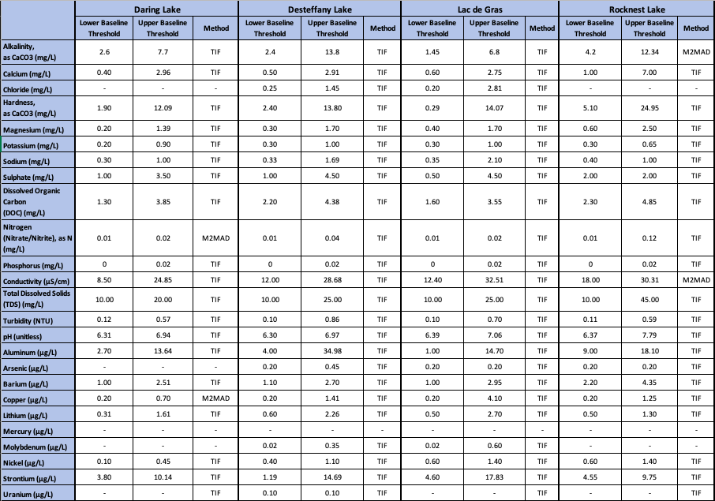
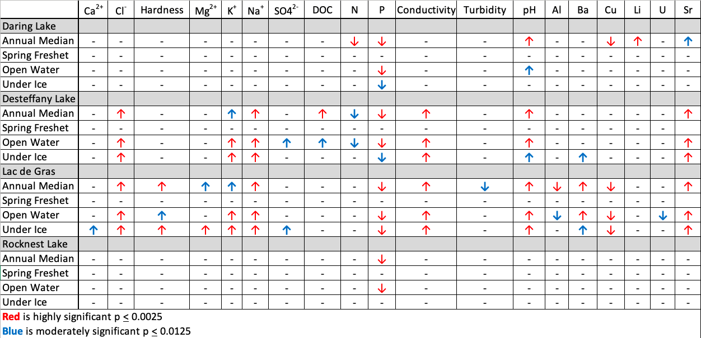
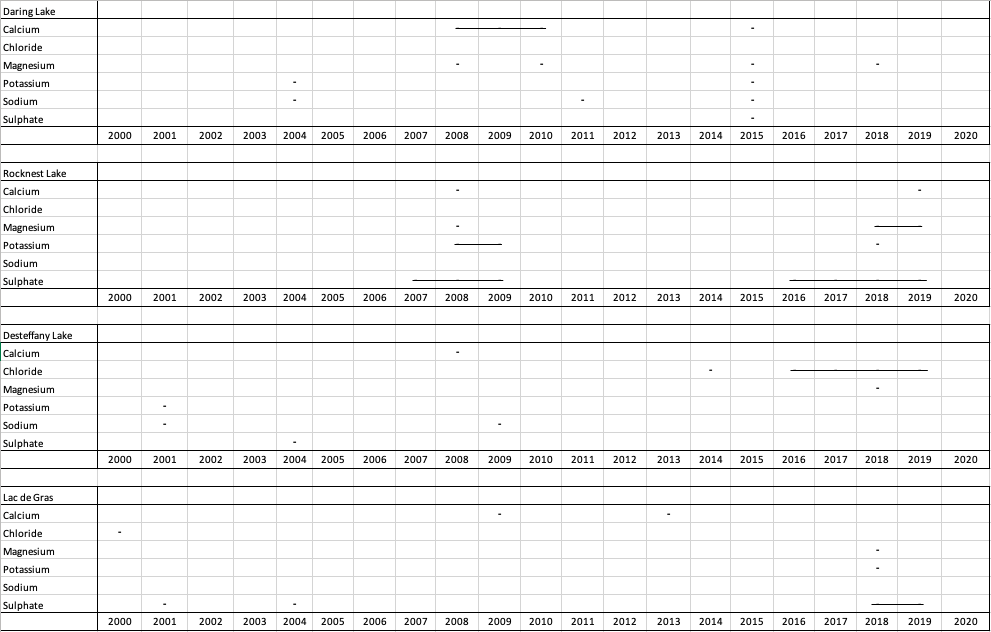
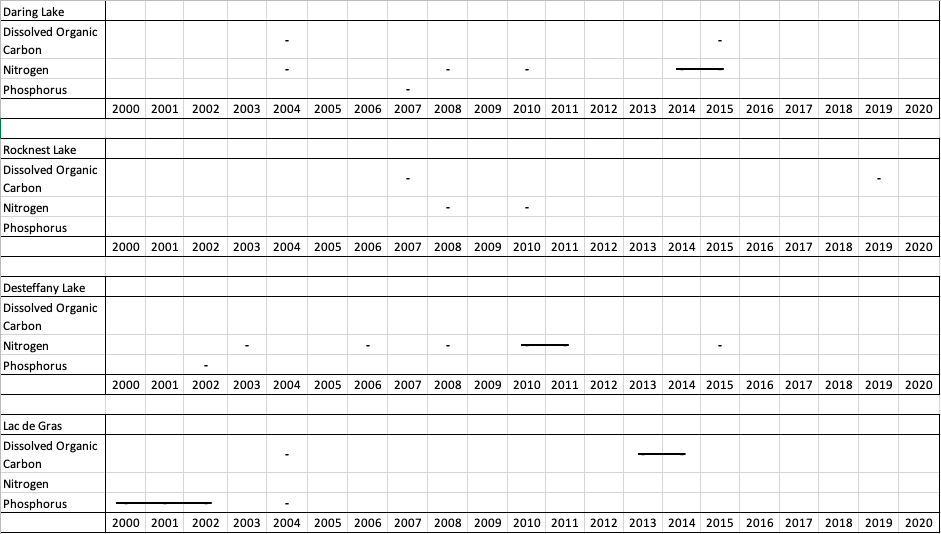
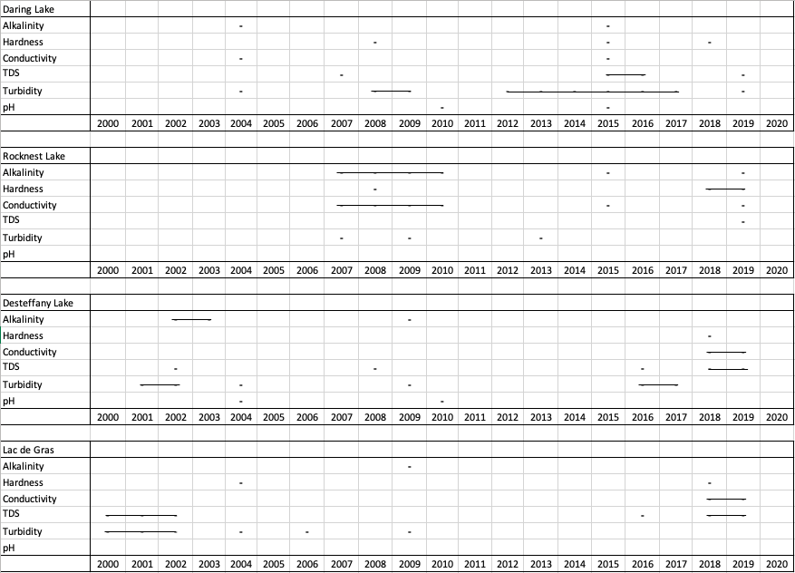
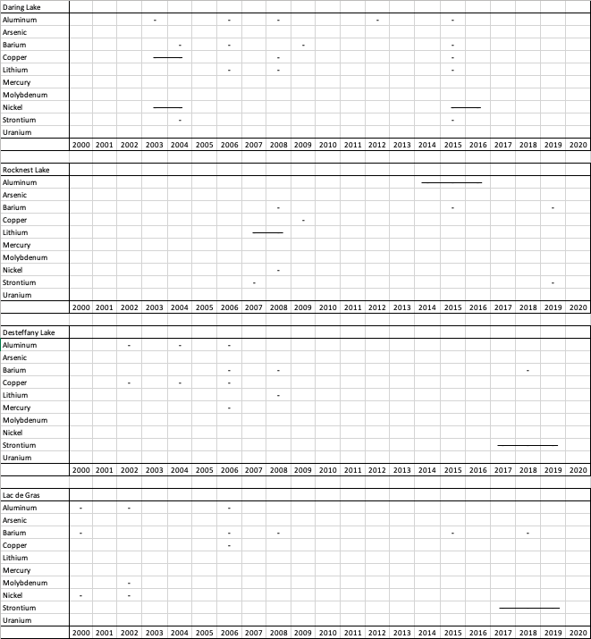

**2.0. Chapter 2 - Baseline analysis of chosen water quality parameters in the Upper Coppermine River Basin.**

**2.1. Summary**

The large Coppermine water quality data set available from the GNWT includes 5 sites within the Upper Coppermine and spans nearly 20 years (2000-2019). Such a robust data set provides the unique opportunity to create ambient baseline ranges for lakes in the area and analyze for any signs of cumulative effects. There are several definitions or types of ‘baselines’. An ambient baseline represents the baseline of geochemical parameters that have been exposed to natural and anthropogenic disturbance, and was therefore chosen as the appropriate baseline for the Upper Coppermine. A literature search showed that there are two statistical methods recommended to be useful for ambient baseline calculation: Tukey’s Inner Fence and Median+2MAD. The choice between these two methods depends upon the amount of outliers and samples below the detection limit. Depending on this, either Tukey’s Inner Fence or Median+2MAD was used to calculate an ambient baseline for individual parameters at four lakes in the Upper Coppermine (Daring Lake, Desteffany Lake, Lac de Gras, and Rocknest Lake). The resulting baselines can be used by NWT CIMP to monitor for future exceedances at these and analogous lakes in the Upper Coppermine. A trend analysis was also completed which showed significant increases in strontium, conductivity, pH, sodium and chloride at Lac de Gras and Desteffany Lake over the last 20 years. Since Daring Lake showed few trends in parameters, it is expected that the changes at Desteffany Lake and Lac de Gras are the result of anthropogenic disturbance more local to these lakes. Careful monitoring should be implemented for these parameters as natural resource development in the Upper Coppermine continues.  

**2.2. Methodology**

According to the CEAA (2012), there are three methods for analyzing cumulative effects data:

Use information about current and past environmental conditions (e.g. water quality monitoring).
Use information on the environmental effects themselves (e.g. reduction in fish population).
Use traditional and local knowledge.

For the purpose of this report, Method 1 will be used. Method 1 uses existing qualitative or quantitative data to improve the understanding of cumulative effects on valued environmental components (VECs) (i.e. water quality parameters). The data is used to determine a baseline that can then be used to compare against past or future data to determine temporal or spatial trends. This method uses specific qualitative or quantitative information about the chosen VECs, natural range of variability, expert knowledge regarding VEC baselines, temporal or spatial patterns of the VEC values, and the current status of the existing environment.

**2.2.1. Geochemical Baseline**

Establishing a baseline for water quality parameters of importance in the Upper Coppermine will help determine evidence of ongoing cumulative effects, as well as aid in the validation of a cumulative effect indexing tool (in Chapter 3 of this report). Researchers have for decades been trying to characterize geochemical baseline or background values for various media (water, soil, air, rock) and a multitude of empirical and statistical methods have been employed; statistical methods being the most effective (Sun, 2015). Regional baseline concentration studies of surface water, however, are greatly lacking (Sahoo et al., 2019).

The terms environmental ‘baseline’ and ‘background’ are used interchangeably in the literature, however, a distinction must be made for the purpose of this report. Environmental or natural background refers to the natural environmental conditions under which no anthropogenic contributions have occurred (Sun, 2015). Environmental baseline signifies ‘ambient background’ and is generally reported as a range (Sahoo et al., 2019). Since the majority of the world has been influenced by one form of human disturbance or another, ‘natural background’ is deemed to no longer exist (Sun, 2015). This project’s study area is downstream from active diamond mines that have been operating over the entire time series of the data set, and where recent and ongoing climatic changes and climate change-related disturbances are occurring; therefore, ambient baseline (as opposed to natural background) is used to represent and calculate the baseline.

Determination of environmental baselines has been attempted using multiple statistical methods (Urresti-Estala et al., 2013, Galuszka, 2007, Gustavsson et al., 2012, Matschullat et al., 2000, Reimann et al., 2005, Sahoo et al., 2019). Mean+2σ was commonly used historically (Reimann et al., 2005), however, it is not appropriate for data that is non-parametric and ‘noisy’, typical of natural science data and the time series of data used here (Reimann et al., 2005). The Mean+2σ method simply involves doubling the standard deviation (σ) and adding or subtracting (+) it to or from the mean of the data set, and does not consider the effect of outliers. Other approaches, such as median+2MAD (Mean Absolute Deviation) and Tukey’s Inner Fence (TIF) box plots, do not incorporate any statistical assumptions, which makes them sufficient for determining baseline ranges for natural science data (Table 4) (Reimann et al., 2005). Mean Absolute Deviation is the summation of absolute difference between the data values and the mean, divided by the number of data points. Tukey’s Inner Fence is the first and third quartiles -/+ 1.5 multiple by the interquartile range.

| Method            | Equation                                                                | Adequate Outlier %  | <DL% (Detection Limit) |
|-------------------|-------------------------------------------------------------------------|---------------------|------------------------|
| Box plot with TIF | Upper = 25th percentile – 1.5*IQR    Lower = 75th percentile + 1.5* IQR | <10%                | 77%                    |
| Median + 2 MAD    | Median + 2 (Σ\|X-u\|/n)                                                 | 15-50%              | 50%                    |
| Mean + 2σ         | Mean + 2σ                                                               | No outliers         | 50%                    |

**Table 4.** Common statistical methods for calculating geochemical bassline ranges and their corresponding limits (Sahoo et al., 2019).

 Box plots, using Tukey’s Inner Fence (TIF), provide the most adequate results when outliers are less than 10% of the dataset, and can handle up to 77% of data below the detection limit (DL) (Sahoo et al. 2019). The Median+2 MAD technique is useful when outliers constitute between 15-50% of the dataset but can handle only datasets with a maximum of 50% of the data below the detection limit (Sahoo et al. 2019). Stantec’s (2015) analysis of the Coppermine River Basin’s water quality data used the box plot method for the reasons stated above. Reimann et al. (2005) details the following steps for this analysis:
1. Plot the cumulative distribution frequency and/or TIF box plot to determine distribution and outliers
2. Calculate the mean, standard deviation and coefficient of variance (CV).
3. If the CV is above 100%, create logarithmically scaled plots for interpretation.
4. Calculate upper and lower fences using Median+2MAD or Tukey’s Inner Fence method.
5. Apply fence values to maps in order to interpret spatial trends.
6. Finally, propose an upper and lower limit for the range.  

Reimann et al. (2005) also points out that there is a high degree of subjectivity involved and expertise required for an accurate geochemical analysis. Expert knowledge of the area is required to understand reasons for outliers and explanations for spatial and temporal trends.

For this project based in the Upper Coppermine, ambient baselines were determined for a set of parameters. The specific parameters (25) were chosen (Table 5) based on two considerations: 1) their relevance to regional disturbances or their importance to regional aquatic ecosystem health, as determined by this report’s review of existing literature (see Section 1.2); and 2) any parameters of interest identified by the GNWT in Stantec’s (2015) report. The baseline analysis was conducted in python via Jupiter Notebook. Data for the analysis was supplied by the GNWT and contained water quality data from 2000-2019.

| **Major Ions**              | **Nutrients**                           | **Physicals**                      | **Metals (Total)** |
|-----------------------------|-----------------------------------------|-------------------------------------|--------------------|
| Alkalinity, as CaCO3 (mg/L) | Nitrogen (Nitrate/Nitrite), as N (mg/L) | Conductivity (μS/cm)                | Aluminum (μg/L)    |
| Calcium (mg/L)              | Phosphorous (mg/L)                      | Total Dissolved Solids (TDS) (mg/L) | Arsenic (μg/L)     |
| Chloride (mg/L)             |                                         | Turbidity (NTU)                     | Barium (μg/L)      |
| Hardness, as CaCO3 (mg/L)   |                                         | pH (unitless)                       | Copper (μg/L)      |
| Magnesium (mg/L)            |                                         |                                     | Lithium (μg/L)     |
| Potassium (mg/L)            |                                         |                                     | Mercury (μg/L)     |
| Sodium (mg/L)               |                                         |                                     | Molybdenum (μg/L)  |
| Sulphate (mg/L)             |                                         |                                     | Nickel (μg/L)      |
|                             |                                         |                                     | Strontium (μg/L)   |
|                             |                                         |                                     | Uranium (μg/L)     |

**Table 5.** Chosen parameters of interest used for baseline analysis.

The GNWT ENR data set contains five sites in the Upper Coppermine, four of which were chosen for analysis in this study: Lac de Gras, Desteffany Lake, Daring Lake and Rocknest Lake (Figure 1). These lakes were selected because they have long data sets (nearly 20 years) and are located at a range of vegetation conditions, geological units and human disturbances in the area. Rocknest Lake is located within the treeline and in the Bear Geological Province. Lac de Gras is a headwater lake in the Upper
Coppermine and very close to active mining. Desteffany Lake is located 58 km downstream from Lac de Gras. Daring Lake is relatively distant from anthropogenic disturbances and is fairly analogous in terms of geology and vegetation to Desteffany Lake and Lac de Gras. Data from the fifth Upper Coppermine lake with water quality data, Point Lake, were not analysed in this study because it did not represent a significantly different environment to any of the other four, however, future work may wish to include it. While there are many water quality data sets generated by industry monitoring campaigns, this project focuses only on the data available through the GNWT. The time required to identify, obtain, and collate these data sets meant that this was beyond the scope of this
project. Future work on cumulative effects to water quality in the Upper Coppermine could consider compiling and analysing industry data.

The chosen parameters (see Table 5) were first separated by site. Parameters were then plotted on boxplots using the data analysis software pythonTM 3.7.3. The inner fences represent the first and third quartiles, and the upper and lower fences represent the first and third quartiles -/+ 1.5*IQR. The
boxplots were visually analysed for differences between lakes, and the presence of outliers. Where known, CCME Freshwater Aquatic Life Water Quality Guidelines (FAL WQG) were added to the boxplots. Next, the baseline statistics were calculated using the TIF, Median+2MAD, and the 98th percentile methods for the chosen parameters, using the ‘agg’ function in python. The ‘agg’ function allows multiple statistical methods to be applied to a grouping of data at once. In this case, the groupings were by lake and then parameter.

The percent below detection limit (DL) of each parameter was calculated by manually filtering the parameters in Excel and counting the number of samples whose ‘Result as Text’ column included a ‘<’ sign. If the percentage of measurements below the detection limit was >77%, no thresholds were calculated and only the mean, median, min, max and standard deviation were presented. Outliers were calculated by counting the outliers visible on the boxplots. If the outlier percentage was ≤ 10% the TIF method was carried out, and if it was >10% the Median+2MAD method was carried out. The 98th percentile was provided as a further means for reference.

**2.2.2. Spatial and Temporal Trends**

In addition to establishing baseline conditions, identifying spatial and temporal trends are also
valuable for interpreting effects to water quality. Effective ways to analyze spatial trends in water
quality data include mapping the data and using spatial data for explanatory variables (e.g. geology,
vegetation, and anthropogenic influences) to interpret the data. A simple visual comparison was
completed which indicated spatial homogeneity. See Fischer and Getis (2009) for more in-depth
spatial analysis techniques.

Temporal trends can be analyzed using approaches such as the Mann-Kendall trend test which
assumes that the data is non-parametric (Hamed and Rao, 1998) as is often the case with geochemical
data. The Mann-Kendall trend test is a rank correlation test, meaning the times series is used to rank
order the data points and determine the presence of a monotonic trend (Hamed and Rao, 1998). The null hypothesis is that no trend exists, and the alternative hypothesis is that an increasing or
decreasing monotonic trend exists. A monotonic trend shows that a variable is either increasing or
decreasing over time but can be linear or non-linear. The Mann-Kendall trend test assumes no serial
correlation. Accuracy decreases with fewer samples and where there are more samples below the
detection limit. When more than one measurement exists for a short time period considering the
length of the entire record (e.g. three in a month if analysing a decade of data; or three in a day if
analysing a year of data), a median value is recommended for non-parametric data. A p-value of <0.05
typically represents a significant trend, while a p-value of <0.01 represents a highly significant trend.

The analysis of trends was carried out to serve as further information on, and provide context to, the
water quality changes occurring in the Upper Coppermine, potentially due to cumulative effects. A
temporal trend analysis was completed using the Mann-Kendall trend test for the chosen parameters
at each lake for annual and hydrological seasons’ medians. Temporal trends were analyzed and
reported, but did not affect the determination of the baseline thresholds because the ambient
baseline represents the current (since 2000) state of the water quality parameters in the Upper
Coppermine, and as such would include any temporal trends in that time period.

For the temporal trend analysis separated by hydrological season, the data was separated into the
following seasons: the ‘Under Ice’ season (data from November to April), the spring freshet season
(data from May and June), and the open water season (data from July to October) (Stantec, 2015). A
median for each year’s hydrological season was calculated using the ‘resample’ annual median
command. The pyMannKendall tool was used in pythonTM to calculate the p-values (Hussain et al.,
2019). The large amount of significance tests performed (4 scenarios (annual median and three hydroseasons)
x 25 parameters = 100) meant that Type 1 errors (i.e. the result of the over estimation of
significance) might occur and needed to be considered, (Stantec, 2015). In order to compensate for
this, the Bonferroni correction was used. The Bonferonni correction considers the number of tests
being performed and their relation to the p-value significance (Cox and Donnelly, 2011). To calculate a
more accurate significance threshold, Equation 1 was used (Cox and Donnelly, 2011). The Bonferroni
correction calculated the new thresholds to be p < 0.0125 and 0.0025, which are equivalent to p-value
thresholds (without the Bonferroni correction) of p < 0.05 and 0.01, respectively. A similar approach
was taken by Stantec (2015).

(1)

*a = 1 – (1-p)n*  

*a = 0.05, 0.01*  
*n = 4*  
*p = corrected p-value*

Linear regression was applied to any data that showed significant annual median trends. Seasonal
annual medians were not further analyzed by linear regression because the Upper Coppermine
typically shows little hydro-season variability owing to its high storage capacity (Stantec, 2015).

**2.2.3. Historical Exceedances**

Further analysis of the water quality data involved determination of historical exceedances. In
Microsoft Excel, the GNWT data set was manually filtered for exceedances of upper and lower
baseline thresholds using the ‘not between’ filter. The date and time, hydrological season, value, and
magnitude of exceedance was recorded. Replicates, and samples recorded below the detection limit,
were not included.

**2.3. Results**

The majority (67%) of samples were collected during the open water season (July to October), 29%
were collected during the under ice season (November to April) and 4% of samples were collected
during the spring freshet (in May/June). Of the 4 lakes and 25 parameters analyzed, Lac de Gras’
dataset contains 6750 samples (2000-2019), Desteffany Lake’s dataset has 5725 samples (2001-
2019), Daring Lake has 5021 samples (2003-2019), and Rocknest Lake has 4246 (2006-2019). All data
are from water samples collected at the lake surface.

Box plots for the 25 chosen water quality parameters are presented in Figures 11-35 in Appendix B1.
More than 10% of the data related to turbidity and copper levels at Daring Lake, and alkalinity and
specific conductivity at Rocknest Lake, were deemed to be outliers, so for these parameters and lakes
the Median+2MAD method is recommended. No significant trends in the outliers were identifiable
from visually scanning the data.

**2.3.1. Geochemical Baseline**

Baseline thresholds were calculated using the TIF, Median+2MAD and 98th percentile methods. The
recommended threshold values, based on the most appropriate method to use considering outliers
and the number of samples below the detection limit, are highlighted in Appendix B3 and Table 6. The
baseline threshold values represent the ambient baseline, which is representative of the entire time
series of the data set and includes outliers.

**2.3.2. Temporal Trends**

19 of the 25 chosen parameters showed at least moderately significant trends in at least one lake
(Table 7). Significant annual median trends were further analyzed with linear regression (Appendix
B4). Parameter-specific results are detailed in the following sections.

**2.3.3. Parameters of Interest**

Physical Properties

pH

The pH data for each lake are normally distributed and have mean values of 6.72 at Daring Lake, 6.68
at Desteffany Lake, 6.74 at Lac de Gras and 7.13 at Rocknest Lake. The mean and median values lie
within the CCME FAL guidelines (6.5-9) and indicate that the lakes are circumneutral (Figure 11).

Daring, Desteffany and Lac de Gras all show lower baseline thresholds below 6.5 suggesting slightly
acidic conditions. As stated previously, granitic shield lakes are very susceptible to changes in acidity
due to their low buffering capacity. Highly significant increasing trends (p<0.0025) (becoming less
acidic) in pH were found for Daring (r2 = 0.56), Desteffany (r2 = 0.65) and Lac de Gras (r2 = 0.77). No
significant trends in pH were observed at Rocknest.

 **Table 6.** Summary table of chosen lakes in the Upper Coppermine and their corresponding upper and lower baseline thresholds for each
parameter of interest. ‘-‘ represent parameters that exceeded the acceptable percentage of samples <DL.

Conductivity

The specific conductivity mean and median values in μS/cm are 15.60 and 12.50 (Daring), 21.78 and
17.60 (Desteffany), 19.23 and 18.30 (Lac de Gras), 26.52 and 22.90 (Rocknest). The distribution is
skewed to the right, meaning the mean is greater than the median (Figure 12). The greatest
conductivity levels are at Rocknest (30.31 μS/cm), which is most likely due to its location below the
treeline and in the BGP. Upper baseline thresholds at Daring, Desteffany and Lac de Gras are 24.85,
28.68 and 32.51. The increased number of outliers at Rocknest (14%) prompts use of the
Median+2MAD method to determine the upper threshold, which was calculated to be 30.31. Highly
significant increasing trends (p<0.0025) are seen at Desteffany (r2 = 0.68) and Lac de Gras (r2 = 0.86)
(Table 7).

 **Table 7.** Trend results for each lake and parameter during the spring freshet, open water, under ice season, and annual median. Upward
pointing arrows indicate significantly increasing trends and downward pointing arrows indicate significantly decreasing trends. A ‘-‘ symbol indicates that
there was no significant trend in the data.

Total Dissolved Solids

The mean and median values of TDS in mg/L are 14.00 and 10.00 (Daring), 15.14 and 12.00
(Desteffany), 14.74 and 10.00 (Lac de Gras), 19.39, and 16.00 (Rocknest). The data is skewed to the
right (Figure 13). Upper thresholds are 20.00, 25.00, 25.00, and 45.00 respectively. It should be noted
that a relatively high percentage (22.8-51.5%) of the TDS data fell below the DL, which reduces the
accuracy of the baseline calculation. No significant trends in TDS were observed.

Turbidity

The mean and median values in NTU are 0.42 and 0.28 (Daring), 0.49 and 0.39 (Desteffany), 0.39 and
0.30 (Lac de Gras), 0.36 and 0.31 (Rocknest). The data is slightly skewed to the right (Figure 14). 18%
of samples are outliers at Daring and therefore require the Median+2MAD method. The upper
baseline threshold was calculated to be 0.41. Desteffany, Lac de Gras and Rocknest have upper
thresholds of 0.86, 0.70 and 0.59. The high number of outliers is noteworthy. A moderately significant
(p<0.0125) decreasing trend in turbidity was observed in Lac de Gras’ annual median (Table 7).

Alkalinity

Alkalinity is measured as the concentration of calcium carbonate in mg/L. Data is slightly skewed to
the right at all sites, the greatest being at Rocknest (Figure 15). Rocknest also has 14% outliers in its
sample population and therefore the Median+2MAD method is preferred. Upper baseline threshold
values of Daring, Desteffany, Lac de Gras and Rocknest are 7.70, 13.80, 6.80 and 12.34 mg/L
respectively. No significant trends were observed.

Hardness

Hardness is measured as the concentration of CaCO3 in mg/L. Mean and median hardness is 6.90 and
5.75 (Daring), 7.78 and 7.44 (Desteffany), 7.48 and 6.75 (Lac de Gras), 13.86 and 12.00 (Rocknest). The
tundra lakes show similarity, while Rocknest shows nearly double the mean and median (Figure 16).
This might be due to the geographic location of Rocknest below the treeline and in the BGP (discussed
further in the discussion section). Highly significant increasing trends (p<0.0025) are observed at
Desteffany and Lac de Gras (Table 7).

Major Ions

Calcium

Calcium is slightly skewed upwards at all lakes (Figure 17). Mean concentration in mg/L is similar in
Daring, Desteffany and Lac de Gras ranging from 1.39-1.52. Rocknest has a significantly higher calcium
concentration of 3.19. Upper baseline thresholds are similar in the lakes above the treeline ranging
from 2.75-2.96, while Rocknest has an upper threshold of 7.00. A moderately significant (p<0.0125)
increasing trend was observed at Lac de Gras during the under-ice season (Table 7).

Chloride

Mean and median chloride values measured in mg/L at are 0.70 and 0.70 (Daring), 0.84, and 0.70
(Desteffany), and 0.98 and 0.70 (Lac de Gras), 0.70 and 0.70 (Rocknest). Upper thresholds at
Desteffany and Lac de Gras are 1.45 and 2.81 (Figure 18). Chloride exceeded the samples <DL at
Daring and Rocknest, therefore, no baseline could be calculated. Desteffany and Lac de Gras showed
significant increasing (p<0.0025) trends in all data sets with the exception of the spring freshet (Table
7).

Magnesium

The mean and median values of magnesium in mg/L are 0.87 and (Daring), 0.97 and 0.85
(Des28iffany), 0.99 and 0.80 (Lac de Gras), 1.48 and 1.20 (Rocknest). Once again Rocknest seems to
have higher magnesium concentrations than the lakes above the treeline (Figure 19). Upper
thresholds are 1.39, 1.70, 1.70, and 2.50 respectively. Significant (p<0.0125) and highly significant
(p<0.0025) increasing trends were observed at Lac de Gras during the under ice season, and annual
median, respectively (Table 7).

Potassium

Data at Daring, Desteffany and Lac de Gras are all skewed to the right, while at Rocknest the data are
normally distributed (Figure 20). Mean potassium decreases downstream from Lac de Gras. Upper
baseline thresholds at Daring, Desteffany, Lac de Gras and Rocknest are 0.90, 1.00, 1.00 and 0.65
respectively. The lakes above the treeline show much similarity. Highly significant (p<0.0025)
increasing trends are observed at Desteffany and Lac de Gras (Table 7).

Sodium

Mean and median values of sodium in mg/L are 0.64 and 0.50 (Daring), 0.83 and 0.75 (Desteffany),
0.89 and 0.70 (Lac de Gras), 0.61 and 0.60 (Rocknest). The data is slightly skewed to the right at lakes above the treeline and normally distributed at Rocknest (Figure 21). Upper baseline thresholds are
1.00, 1.69, 2.10 and 1.00 respectively. Highly significant (p<0.0025) increasing trends were observed
at Desteffany and Lac de Gras (Table 7).

Sulphate

The mean and median sulphate concentrations measured in mg/L are 1.66 and 1.00 (Daring), 2.78 and
3.00 (Desteffany), 2.82 and 3.00 (Lac de Gras), 2.27 and 2.00 (Rocknest). Upper baseline thresholds
for the lakes were 3.50, 4.50, 4.50 and 2.00, respectively (Figure 22). Significant increasing (p< 0.0125)
trends were observed for data from Desteffany’s open water season and Lac de Gras’ under ice
season.

Nutrients

Dissolved Organic Carbon

Dissolved organic carbon (DOC) is slightly skewed to the right at Daring and Rocknest (Figure 23).
Mean DOC measured in mg/L varies from 2.52-3.58. Upper thresholds are all fairly similar, calculated
to be 3.85, 4.38, 3.55, and 4.85 respectively. A significant increasing (p<0.0125) trend was observed at
Desteffany for the open water season and a highly significant (p<0.0025) increasing trend was
observed for the annual median (Table 7).

Nitrogen

Nitrogen was calculated as nitrogen and nitrate combined and measured in mg/L. Due to much of the
sample population being below the detection limit the baseline results have reduced accuracy. The
mean and median for the tundra lakes is 0.03 and 0.01 respectively. The mean and median for
Rocknest was 0.05 and 0.03 (Figure 24). A highly significant (p<0.0025) decreasing trend was seen in
Daring’s annual median and a significant (p<0.0125) decreasing trend was observed in Desteffany’s
open water and annual median (Table 7). Note, the extreme <DL nature of nutrients measured
reduces the accuracy of the trend test.

Total Phosphorus

Total mean and median phosphorus measured in mg/L is 0.01 and 0.00 (Daring), 0.01 and 0.00
(Desteffany), 0.01 and 0.01 (Lac de Gras), 0 and 0 (Rocknest). The relatively high percentage of
samples below the detection limit (>35%) reduces the accuracy of the baseline analysis. Based on the
available data, which is upward skewed, the lakes are ultra-oligotrophic to oligotrophic, according to
CCME guidelines (Figure 25). The upper baseline threshold extends to mesotrophic status. All lakes
show highly significant (p<0.0025) decreasing trends in total phosphorus, however, this appears to be
due to a changing DL (Table 7).

Total Metals

Aluminum

The mean and median values of aluminum in μg/L are 9.05 and 7.10 (Daring), 15.05 and 12.00
(Desteffany), 13.58 and 5.10 (Lac de Gras), 14.79 and 12.50 (Rocknest). The data is skewed to the right (Figure 26). Except for one outlier at Lac de Gras (330 μg/L) the rest of the data are below the CCME
FAL WQL of 100 μg/L. The upper thresholds of Daring, Desteffany, Lac de Gras, and Rocknest are
13.64, 34.98, 14.70 and 18.10 respectively. Desteffany has a much higher aluminum threshold,
perhaps owing to regularly-occurring slumping events, or some other spatial heterogeneity.
Significant decreasing trends are present at Lac de Gras, however, these are due to a changing DL
over time (Table 7).

Arsenic

The mean and median concentration of arsenic measured in μg/L at is 0.21 and 0.20 (Daring), 0.24
and 0.20 (Desteffany), 0.29 and 0.20 (Lac de Gras), 0.22 and 0.20 (Rocknest). The percentage of
samples below the detection limit exceeded 77% at Daring, limiting its baseline analysis. Desteffany
has an upper threshold of 0.45, while Lac de Gras and Rocknest have upper thresholds of 0.20. No
significant trends were identified. All measurements were well below the CCME WQG recommended
threshold of 5 μg/L (Figure 27).

Barium

Total mean and median barium concentrations measured in μg/L are 1.70 and 1.20 (Daring), 1.97 and
1.83 (Desteffany), 2.02 and 1.80 (Lac de Gras), 3.14 and 2.80 (Rocknest). The data are skewed to the
right (Figure 28). Rocknest has the highest concentrations. No trends were identified.

Copper

Total mean and median copper concentrations measured in μg/L are 0.50 and 0.40 (Daring), 1.97 and
1.83 (Desteffany), 1.10 and 0.70 (Lac de Gras), 0.69 and 0.70 (Rocknest). Greater than 10% outliers at
Daring prompts the recommendation of the Median+2MAD method. Upper baseline thresholds for
the lakes are 0.70, 2.70, 4.10, and 1.25 respectively (Figure 29). Daring shows a highly significant
decreasing trend in copper, as well as Lac de Gras (Table 7).

Lithium

Total mean and median lithium concentrations measured in μg/L are 1.03 and 0.90 (Daring), 1.52 1.30
(Desteffany), 1.65 and 1.40 (Lac de Gras), 0.97 and 0.90 (Rocknest). The data is close to a normal
distribution (Figure 30). The upper baseline thresholds in the lakes are 1.61, 2.26, 2.70 and 1.30
respectively. The only trend was an increasing highly significant (p<0.0025) annual median trend in
DL.

Mercury

The total mercury concentration in μg/L is significantly below detection (<90%) at all four lakes and
therefore no baseline thresholds were calculated. Mean and median were calculated to be 0.01 for all
lakes. No temporal trends were identified. Except for one outlier at Lac de Gras in 2013 (0.14 μg/L),
all measurements are below the CCME FAL WQG of 0.026 μg/L (Figure 31).

Molybdenum

The total mean and median molybdenum concentrations measured in μg/L are 0.10 and 0.10
(Daring), 0.22 and 0.10 (Desteffany), 0.37 and 0.20 (Lac de Gras), 0.11 and 0.10 (Rocknest). A significantly high proportion of samples were below the detection limit at Daring and Rocknest and
therefore no baseline thresholds were calculated there. The upper baseline thresholds at Desteffany
and Lac de Gras are 0.35 and 0.60 respectively. No trends were identified. All measurements are
significantly below the CCME FAL WGL of 73 μg/L Figure 32).

Nickel

The total mean and median nickel concentrations measured in μg/L are 0.31 and 0.20 (Daring), 0.83
and 0.80 (Desteffany), 1.02 and 1.00 (Lac de Gras), 0.62 and 0.60 (Rocknest). The data is normally
distributed. No significant trends were identified. All measurements are well below the recommended
CCME FAL WQG limit of 25 μg/L (Figure 33).

Strontium

The total mean and median strontium concentrations measured in μg/L are 6.70 and 5.70 (Daring),
8.29 and 7.80 (Desteffany), 8.89 and7.62 (Lac de Gras), 7.39 and 7.20 (Rocknest). Mean strontium
levels are higher in Desteffany and Lac de Gras (Figure 34). Highly significant increasing trends
(p<0.0025) are seen at Desteffany (r2=0.77) and Lac de Gras (r2=0.89). A moderately significant
increasing annual median trend is apparent at Daring. Strontium is a noteworthy metal in the Upper
Coppermine because it is a constituent in the Ekati mine effluent. Future attention should be paid to
this metal, especially because of its increasing trajectory.

Uranium

Total uranium was significantly below the detection limit at Daring, Lac de Gras and Rocknest. Only at
Desteffany was a baseline threshold calculated, equalling 0.10 μg/L. A moderately significant
(p<0.0125) decreasing trend is apparent at Lac de Gras, however, the high amount of samples below
the detection limit reduces the trends accuracy. All measurements are well below the CCME FAL WQG
recommended threshold of 15 μg/L (Figure 35).

**2.3.4. Historical Baseline Threshold Exceedances**

Exceedances are defined as historical samples that lie outside of the calculated baseline thresholds.
There were 260 exceedances in total, occurring across the four lakes and 25 parameters. All
parameters except for mercury and uranium showed an exceedance in at least one lake. Currently, (as
of 2019) 13 of the 25 parameters examined are exceeding the calculated baseline thresholds.
Rocknest exceeded the most parameters (10), followed by Desteffany (4) and Lac de Gras (4), and
Daring (2). See appendix B5 for the full list of exceedances. Refer to figures 6-10 for exceedance
trends.

Major Ions

Calcium exceedances occurred at all lakes across the data set, during ‘Under Ice’ at Lac de Gras, ‘Open
Water’ at Desteffany and Rocknest Lake, and both seasons at Daring Lake. Chloride was only
exceeded during the ‘Under Ice’ season and occurred consecutively from 2016 to 2019 at Desteffany.
Hardness and magnesium mainly exceeded thresholds during the ‘Open Water’ season and occurred
consecutively in 2018 and 2019 at Rocknest. The potassium threshold was exceeded at Rocknest
consecutively in 2008 and 2009. All potassium exceedances occurred during the ‘Under Ice’ season.
No sodium exceedances occurred at Lac de Gras or Rocnest. Sulphate exceedances occurred during
both the ‘Under Ice’ and ‘Open Water seasons and a significant exceedance trend is seen at Rocknest
where exceedances occurred consecutively in 2008 and 2009 and then from 2016 to 2019. Alkalinity
is exceeded during the ‘Under Ice’ season at Daring, ‘Open Water’ at Lac de Gras and Rocknest and
both seasons at Desteffany. Consecutive exceedances of alkalinity occurred from 2002-2003 at
Desteffany and 2007-2010 at Rocknest.

Nutrients

All DOC exceedances occurred during the ‘Under Ice’ season and a sequential exceedance occurred in
2013 and 2014 at Lac de Gras. Daring and Desteffany Lake had a large amount of nitrogen
exceedances, however, due to the high amount of samples below the detection limit, the accuracy of
the baseline is reduced. In order to better gauge the behaviour of nitrogen in these lakes it is
recommended that the detection limit be lowered. Phosphorus rarely exceeded its thresholds and
hasn’t done so since 2007 at Daring. 2000-2002, at Lac de Gras was the only instance of a consecutive
annual exceedance.

Physical Properties

The conductivity thresholds were exceeded in 2018 and 2019 at Desteffany Lake and Lac de Gras, and
from 2007-2010 at Rocknest Lake. Exceedances of TDS occurred during multiple hydro-seasons, and
show notable exceedances in 2018-2019 at Desteffany and Lac de Gras. Turbidity has been routinely
exceeded at Daring Lake from 2008 to 2019. Few pH exceedances occurred at Daring and Desteffany,
while none occurred at Lac de Gras and Rocknest. The few pH exceedances identified were negative,
meaning more acidic.

Metal

Aluminium exceeded its threshold at Rocknest Lake from 2014-2016. Barium exceeded its threshold
at Lac de Gras in 2018 and 2019. Copper exceeded its threshold at Daring Lake in 2003 and 2004.
Lithium exceeded its threshold in 2007 and 2008 at Rocknest. Nickel exceedances occurred at Daring
in 2003 and 2004, and 2015 and 2016. Strontium exceedances all occurred during the ‘Under Ice’
season, except a Rocknest where it occurred during ‘Open Water’. Sequential annual strontium
exceedances occurred at Desteffany Lake and Lac de Gras from 2017-2019.

Overall, exceedances have occurred several times throughout the Upper Coppermine in the last 20
years, during various seasons. Some exceedances may be natural, and others are possibly due to
cumulative effects. Moving forward it is recommended to look for correlation between environmental
factors such as slumping, mine effluent road building, hydrology, and exceedances in order to
determine causes. As well, it is recommended that exceedance trends seen in 2017 to 2019 are
monitored, to determine if they continue in the coming sampling year(s).

**2.4. Discussion and Conclusion**

Outcomes of the baseline analysis include a set of statistically-determined ambient baseline ranges,
noticeable differences in water chemistry between lakes in the Upper Coppermine, significant
temporal trends and historical baseline exceedances.

The boxplot baseline analysis showed that the mean and median values of all parameters in the
Upper Coppermine are below the CCME FAL water quality guidelines. Median total phosphorus levels
indicate the lakes are ultra-oligotrophic to oligotrophic. All of the lakes show a median pH between
6.5 and 7.5 indicating that they are circumneutral. All the lakes are low in ions and show spatial
homogeneity. An average mean hardness of 9 mg/L classifies the Upper Coppermine lakes as soft
water. Much of the data is slightly skewed to the right, as is typical of water quality data.

Rocknest Lake likely owes its higher median hardness, alkalinity, barium, pH, TDS, DOC, total nitrogen,
calcium and magnesium to its location below the treeline and in a different geological setting to the
other three lakes (i.e. in the BGP) where there is more vegetation and erosion rates are higher. The
absence of significant temporal trends in Rocknest Lake’s water quality data indicate that there are no
significant steadily increasing impacts occurring, however its high number of baseline exceedances
requires further investigation. Although, Rocknest’s variability may very well be due to natural
variability from hydrological seasons and terrestrial input.

Lac de Gras has notably the highest median strontium and lithium concentrations. Daring Lake
showed the lowest values for nearly all parameters, as well as the smallest interquartile ranges, which
might indicate little disturbance in its local drainage area and/or little impact from disturbance.
Rocknest Lake and Lac de Gras show the largest interquartile ranges in most parameters, indicating
great variability in those parameters, and suggesting there are more disturbances in their local
drainage areas. Rocknest Lake possibly owes its variability to increased vegetation, more easily
eroded bedrock and seasonal fluctuations. Lac de Gras potentially owes its variability to the diamond
mining operations in its drainage area and long term temporal trends.

Lac de Gras and Desteffany Lake have similar water quality characteristics and concentrations. Many
of the water quality parameters show significant temporal trends at Lac de Gras and Desteffany Lake,
which is in contrast to Daring and Rocknest Lakes where there are fewer significant changes in water
quality parameters. Increasing major ion concentration (Na, by 419% at Lac de Gras and 174% at
Desteffany) and DOC (by 9% at Lac de Gras and 26% at Desteffany) are warning signs of potential
active layer thickening and thermokarst slumping (Burd et al. 2018 and Kokelj, 2009). Increasing
conductance (by 94% at Lac de Gras and 45% at Desteffany) is a possible sign of impacts from road
dust (Zhu et al. 2019), or more likely, the treated mine effluent. As well, increasing strontium
concentrations (by 223% at Lac de Gras and 103% at Desteffany) and pH (by 5% at Lac de Gras and 6%
at Desteffany) is potentially a sign of impacts from upstream effluent from diamond mine operations
(Deton’ Cho Stantec, 2015). Therefore, at these two lakes, there is evidence of cumulative effects to
water quality.

Daring Lake appears to be a good choice for a reference lake in the tundra environment above the
treeline in the Upper Coppermine. Its small interquartile ranges (Appendix B2) and lack of significant
temporal trends suggest that it has undergone little transformation and impacts from disturbance
over the period of record. When compared to its neighboring lakes, Desteffany and Lac de Gras, it
appears relatively undisturbed. An example of this are the two highly significant (p<0.0025) increasing
temporal trends in strontium and specific conductivity at Desteffany Lake and Lac de Gras. By
comparison, Daring Lake shows no trend in conductivity or strontium in either the open water or
under ice seasons. Notably, Daring Lake is situated in the Yamba River sub-basin while Desteffany
Lake and Lac de Gras are in a neighbouring sub-basin (Figure 1.b). Possibly, the absence of obvious
cumulative impacts to the water quality of Daring Lake is a result of its different contributing area and
less disturbance therein, as compared to the contributing area for Lac de Gras and Desteffany Lake.
While Daring Lake is a good choice for a baseline reference lake, it is important to consider that
spatially extrapolating understanding of a system involves uncertainty. It is suggested to examine the
vegetation, bedrock, and glacial sediment cover to ensure a similar drainage area to the reference
lake.

Overall, the water quality of Upper Coppermine lakes appears to be relatively spatially homogeneous.
The greatest controls on water quality appear to be geology, vegetation, climate, followed by
anthropogenic activity. Where terrestrial input is greatest (bedrock and vegetation), the more
dramatic differences in water chemistry are seen, such as at Rocknest Lake. Anthropogenic activity
(e.g. diamond mining) seems to have a potentially dramatic, but local, effect, which is seen at
Desteffany Lake and Lac de Gras. Exceedances occur relatively frequently in all lakes over the last 20
years, however, close attention should be paid to the frequency and magnitude of future
exceedances as cumulative effect drivers are set to increase.

Future baseline analysis should consider including the vast amount of available industry water quality
data in order to validate this study’s findings. Further, statistical and numerical modelling of potential
future change of parameters should be explored. Careful attention should be paid to the increasing
trends at Lac de Gras along with further research into disturbances and cumulative effects occurring
in the sub-basin. More regular monitoring for strontium, conductivity, pH should be considered for
the Lac de Gras area. Monitoring should be continued for the parameters and lakes that showed
exceedance trends in the last 3 years. Finally, traditional and local knowledge should be used to help
deepen the understanding of the ambient baseline water quality in the Upper Coppermine.

**Figure 6.** Major ion exceedances. A ‘-‘ symbol represents an exceedance.

**Figure 7.** Nutrient exceedances. A ‘-‘ symbol represents an exceedance.

**Figure 8.** Physical parameter exceedances. A ‘-‘ symbol represents exceedance.

**Figure 9.** Metal exceedances. A ‘-‘ symbol represents an exceedance.

[Index](index.md)
