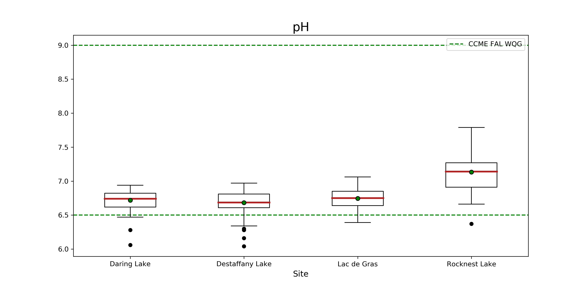
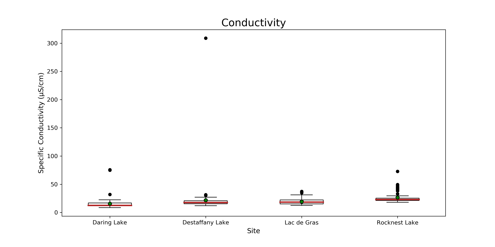

# Appendix B1: Box Plots

  
 **Figure 11. Boxplot of pH at Daring, Desteffany, Lac de Gras and Rocknest Lake.** The red line indicates the median, and the green dot indicates the mean, for each lake. The whiskers represent 1.5 x the interquartile range +/- Q3 and Q1. Black dots are outliers. The green dashed line represents the CCME FAL WQL.

  
 **Figure 12. Boxplot of conductivity at Daring, Desteffany, Lac de Gras and Rocknest Lake.** The red line indicates the median, and the green dot indicates the mean, for each lake. The whiskers represent 1.5 x the interquartile range +/- Q3 and Q1. Black dots are outliers.

  
 **Figure 13. Boxplot of TDS at Daring, Desteffany, Lac de Gras and Rocknest Lake.** TThe red line indicates the median, and the green dot indicates the mean, for each lake. The whiskers represent 1.5 x the interquartile range +/- Q3 and Q1. Black dots are outliers.
