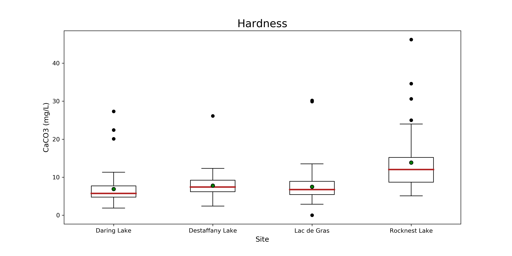
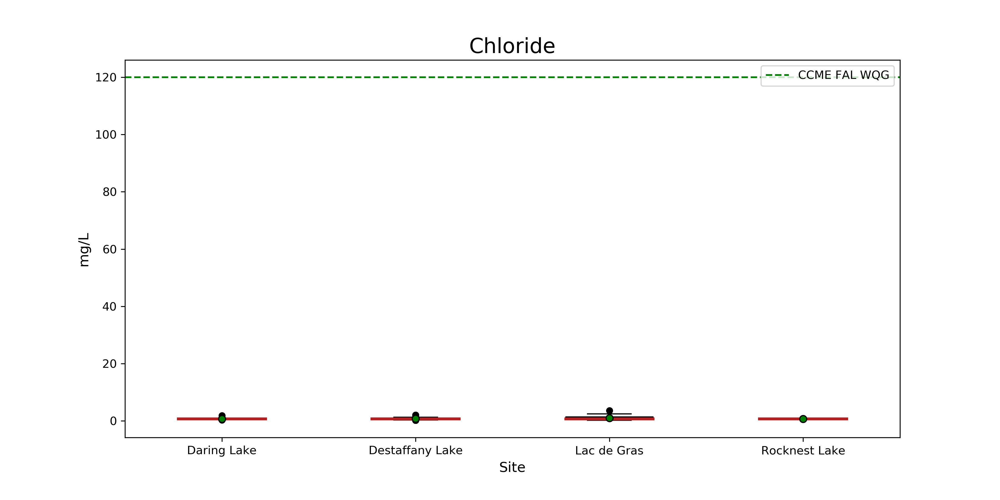
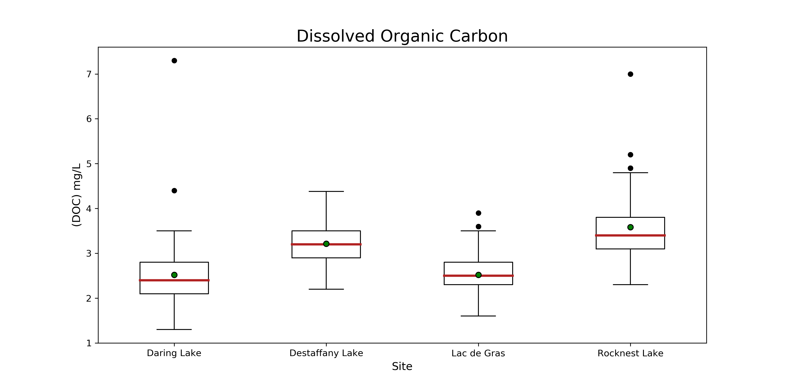
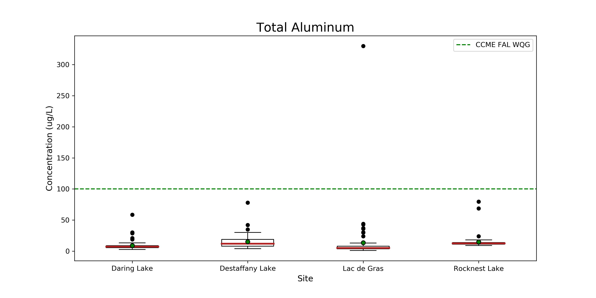

# Appendix B1: Box Plots

  
 **Figure 11. Boxplot of pH at Daring, Desteffany, Lac de Gras and Rocknest Lake.** The red line indicates the median, and the green dot indicates the mean, for each lake. The whiskers represent 1.5 x the interquartile range +/- Q3 and Q1. Black dots are outliers. The green dashed line represents the CCME FAL WQL.

  
 **Figure 12. Boxplot of conductivity at Daring, Desteffany, Lac de Gras and Rocknest Lake.** The red line indicates the median, and the green dot indicates the mean, for each lake. The whiskers represent 1.5 x the interquartile range +/- Q3 and Q1. Black dots are outliers.

  
 **Figure 13. Boxplot of TDS at Daring, Desteffany, Lac de Gras and Rocknest Lake.** The red line indicates the median, and the green dot indicates the mean, for each lake. The whiskers represent 1.5 x the interquartile range +/- Q3 and Q1. Black dots are outliers.

  
 **Figure 14. Boxplot of turbidity at Daring, Desteffany, Lac de Gras and Rocknest Lake.** The red line indicates the median, and the green dot indicates the mean, for each lake. The whiskers represent 1.5 x the interquartile range +/- Q3 and Q1. Black dots are outliers.

  
 **Figure 15. Boxplot of alkalinity at Daring, Desteffany, Lac de Gras and Rocknest Lake.** The red line indicates the median, and the green dot indicates the mean, for each lake. The whiskers represent 1.5 x the interquartile range +/- Q3 and Q1. Black dots are outliers.

  
 **Figure 16. Boxplot of hardness at Daring, Desteffany, Lac de Gras and Rocknest Lake.** The red line indicates the median, and the green dot indicates the mean, for each lake. The whiskers represent 1.5 x the interquartile range +/- Q3 and Q1. Black dots are outliers.

  
 **Figure 17. Boxplot of calcium at Daring, Desteffany, Lac de Gras and Rocknest Lake.** The red line indicates the median, and the green dot indicates the mean, for each lake. The whiskers represent 1.5 x the interquartile range +/- Q3 and Q1. Black dots are outliers.

  
 **Figure 18. Boxplot of chloride at Daring, Desteffany, Lac de Gras and Rocknest Lake.** The red line indicates the median, and the green dot indicates the mean, for each lake. The whiskers represent 1.5 x the interquartile range +/- Q3 and Q1. Black dots are outliers. The green dashed line represents the CCME FAL WQL.

  
 **Figure 19. Boxplot of magnesium at Daring, Desteffany, Lac de Gras and Rocknest Lake.** The red line indicates the
median, and the green dot indicates the mean, for each lake. The whiskers represent 1.5 x the interquartile range +/- Q3 and Q1.
Black dots are outliers.

  
 **Figure 20. Boxplot of potassium at Daring, Desteffany, Lac de Gras and Rocknest Lake.** The red line indicates the
median, and the green dot indicates the mean, for each lake. The whiskers represent 1.5 x the interquartile range +/- Q3 and Q1.
Black dots are outliers.

  
 **Figure 21. Boxplot of sodium at Daring, Desteffany, Lac de Gras and Rocknest Lake.** The red line indicates the median, and the green dot indicates the mean, for each lake. The whiskers represent 1.5 x the interquartile range +/- Q3 and Q1. Black dots are outliers.

  
 **Figure 22. Boxplot of sulphate at Daring, Desteffany, Lac de Gras and Rocknest Lake.** The red line indicates the median, and the green dot indicates the mean, for each lake. The whiskers represent 1.5 x the interquartile range +/- Q3 and Q1. Black dots are outliers.

  
 **Figure 23. Boxplot of dissolved organic carbon at Daring, Desteffany, Lac de Gras and Rocknest Lake.** The red line indicates the median, and the green dot indicates the mean, for each lake. . The whiskers represent 1.5 x the interquartile range +/- Q3 and Q1. Black dots are outliers.

  
 **Figure 24. Boxplot of nitrogen at Daring, Desteffany, Lac de Gras and Rocknest Lake.** The red line indicates the
median, and the green dot indicates the mean, for each lake. The whiskers represent 1.5 x the interquartile range +/- Q3 and Q1.
Black dots are outliers.

  
 **Figure 25. Boxplot of total phosphorus at Daring, Desteffany, Lac de Gras and Rocknest Lake.** The red line indicates the median, and the green dot indicates the mean, for each lake. The whiskers represent 1.5 x the interquartile range +/- Q3 and Q1. Black dots are outliers.

  
 **Figure 26. Boxplot of total aluminum at Daring, Desteffany, Lac de Gras and Rocknest Lake.** The red line indicates the median, and the green dot indicates the mean, for each lake. The whiskers represent 1.5 x the interquartile range +/- Q3 and Q1. Black dots are outliers.

  
 **Figure 27. Boxplot of total arsenic at Daring, Desteffany, Lac de Gras and Rocknest Lake.** The red line indicates the median, and the green dot indicates the mean, for each lake. The whiskers represent 1.5 x the interquartile range +/- Q3 and Q1. Black dots are outliers. The green dashed line represents the CCME FAL WQL.

  
 **Figure 28. Boxplot of total barium at Daring, Desteffany, Lac de Gras and Rocknest Lake.** The red line indicates the median, and the green dot indicates the mean, for each lake. The whiskers represent 1.5 x the interquartile range +/- Q3 and Q1. Black dots are outliers.

  
 **Figure 29. Boxplot of total copper at Daring, Desteffany, Lac de Gras and Rocknest Lake.** The red line indicates the median, and the green dot indicates the mean, for each lake. The whiskers represent 1.5 x the interquartile range +/- Q3 and Q1. Black dots are outliers.

  
 **Figure 30. Boxplot of total lithium at Daring, Desteffany, Lac de Gras and Rocknest Lake.** The red line indicates the median, and the green dot indicates the mean, for each lake. The whiskers represent 1.5 x the interquartile range +/- Q3 and Q1. Black dots are outliers.

  
 **Figure 31. Boxplot of total mercury at Daring, Desteffany, Lac de Gras and Rocknest Lake.** The red line indicates the median, and the green dot indicates the mean, for each lake. The whiskers represent 1.5 x the interquartile range +/- Q3 and Q1. Black dots are outliers. The green dashed line represents the CCME FAL WQL.

  
 **Figure 32. Boxplot of total molybdenum at Daring, Desteffany, Lac de Gras and Rocknest Lake.** The red line indicates the median, and the green dot indicates the mean, for each lake. The whiskers represent 1.5 x the interquartile range +/- Q3 and Q1. Black dots are outliers . The green dashed line represents the CCME FAL WQL.

  
 **Figure 33. Boxplot of total nickel at Daring, Desteffany, Lac de Gras and Rocknest Lake.** The red line indicates the median, and the green dot indicates the mean, for each lake. The whiskers represent 1.5 x the interquartile range +/- Q3 and Q1. Black dots are outliers. The green dashed line represents the CCME FAL WQL.

  
 **Figure 34. Boxplot of total strontium at Daring, Desteffany, Lac de Gras and Rocknest Lake.** The red line indicates the median, and the green dot indicates the mean, for each lake. The whiskers represent 1.5 x the interquartile range +/- Q3 and Q1. Black dots are outliers.

  
 **Figure 35. Boxplot of total uranium at Daring, Desteffany, Lac de Gras and Rocknest Lake.** The red line indicates the median, and the green dot indicates the mean, for each lake. The whiskers represent 1.5 x the interquartile range +/- Q3 and Q1. Black dots are outliers. The green dashed line represents the CCME FAL WQL.
