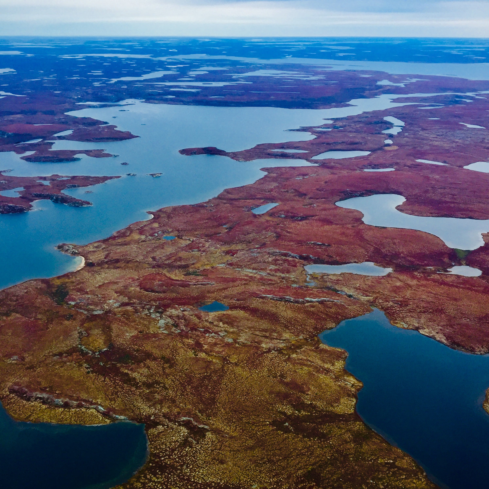

---
---

# EXPLORING CUMULATIVE IMPACTS TO WATER QUALITY IN THE UPPER COPPERMINE RIVER BASIN, NWT

**Student**: Dylan Deck

**Partner**: Anna Coles, Ph.D., Northwest Territories Cumulative Impact Monitoring Program

**Faculty Advisor**: Dr. Andrew Ireson School of Environment and Sustainability, University of Saskatchewan

**Date**: May-August, 2020

*A project report submitted in partial fulfilment for the Masters in Water Security degree*

[Executive summary](execsum.md)

[Introduction](intro.html)

[Study Region](site.html)

[Methodology](Methodology.html)

[1.0. Chapter 1 - Literature review](Chapter1.md) 

[2.0 Chapter 2 - Baseline analysis](Chapter2.html)

[3.0 Chapter 3 - Cumulative Effect Indexing Tool](Chapter3.html)

[Summary of findings](findings.html)

[Towards a solution](solution.html)

[References](references.html)

[Appendix A](appendixA.html)

[Appendix B1](appendixB1.html)

[Appendix B2](appendixB2.html)

[Appendix B3](appendixB3.html)

[Appendix B4](appendixB4.html)

[Appendix B5](appendixB5.html)

## Acknowledgements

I wish to express my deepest gratitude to Anna Coles, Dion Kelly and staff from the Northwest Territories Cumulative Impact Monitoring Program in the Government of the Northwest Territories, and Andrew Ireson from the Global Institute of Water Security, University of Saskatchewan, for their continued support and expert knowledge. This project was funded by the Northwest Territories Cumulative Impact Monitoring Program (NWT CIMP).

Unknown lake in the Upper Coppermine River Basin, September 2019, Anna Coles.
