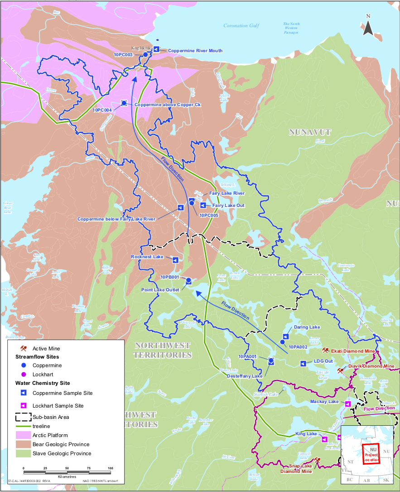

---
---

# Introduction

The Coppermine River basin is located in in the North Slave and Kitikmeot regions of Northwest Territories and Nunavut, respectively (Figure 1.a). It has been recognized as one of the most important and pristine river systems in the Canadian Central Arctic (Stantec, 2015). Recent and ongoing natural resource development and climate change are threatening and putting pressure on the ecological integrity of the area. 

The combination of these threats on the environment is known as ‘cumulative effects’. The Canadian Council of Ministers of the Environment (CCME, 2014, p.1) defines cumulative impacts, or effects, as “a change in the environment caused by multiple interactions among human activities and natural processes that accumulate across space and time”. The Northwest Territories Cumulative Impact Monitoring Program (NWT CIMP) has adopted this definition of cumulative impacts. A cumulative impact assessment is different to an environmental impact assessment in that a cumulative impact assessment typically examines the impact of multiple disturbances on individual valued environmental components (VECs), whilst environmental impact assessments focus on the impact of one disturbance on several VECs. Further, a cumulative impact assessment might look more broadly at a regional scale and examine longer temporal scales (IAAC, 2016). 

The Upper Coppermine River basin, which will be henceforth referred to as the Upper Coppermine, is a lake system located upstream, in the southern half of the basin. In the Upper Coppermine, activities such as diamond mining and road development are thought to be impacting the water quality of lakes and rivers (Zajdlik, 2016). Climate change is potentially directly (e.g. via increased atmospheric temperature) and indirectly (e.g. via permafrost thaw-related landscape changes) further impacting the aquatic environment. These natural and anthropogenic disturbances combine to create cumulative effects to water quality. Potential changes in water quality are of significant importance to aquatic ecosystems and fish, and could impact land users’ and other stakeholders’ activities in the Upper Coppermine. Understanding these cumulative effects to water quality through, for example, knowledge sharing, lake monitoring, model predictions, and data analysis and interpretation, is crucial for staying informed of changes and supporting sustainable environmental management. Indigenous governments and organizations (for example Tlicho Government, Akaitcho Territory Government, North Slave Metis Alliance, and NWT Metis Nation), the Government of the Northwest Territories and Government of Canada, industry, communities, and decision makers (for example, Wek'èezhı̀i Land and Water Board) are all stakeholders with interests in the water quality of the Upper Coppermine and neighbouring regions. 

The overall aim of this study is to improve the understanding of cumulative impacts to water quality in the Upper Coppermine. In order to achieve this goal, the specific objectives and approaches are:	

1. To understand the existing state of knowledge of cumulative impacts to water quality in the Upper Coppermine and similar Taiga Shield regions. 

For this first objective, this project systematically searches an online publication database and identifies published literature on cumulative impact research in the Upper Coppermine and similar northern regions.

2. To determine and validate appropriate data analysis method(s) for assessing the baseline conditions and natural range of variation (NRV) of water quality parameters to aid in the detection of potential cumulative impacts from natural or anthropogenic disturbances.

To address the second objective, this project reviews existing statistical baseline determination techniques, and then uses existing long-term government water quality data to better constrain and establish baseline conditions for certain water quality parameters for select lakes in the Upper Coppermine. Determining a baseline for key water quality parameters is crucial for detecting current or future cumulative impacts, especially as or when industrial development continues

3. To evaluate the reliability of outputs from an R/ArcGIS-based predictive cumulative effect indexing tool.

Finally, for the third objective, this project uses the water quality baseline results to evaluate an existing cumulative impact index tool recently developed for NWT CIMP by Ecofish Research Ltd.

This project, which seeks to understand cumulative impacts to water quality in the Upper Coppermine River basin of the Northwest Territories, aligns with NWT CIMP’s vision to “watch and understand the land so it can be used respectfully forever”.

 **Figure 1.a.** Overview of the Coppermine River Basin and geological provinces. From Stantec (2015).

[Index](index.md)
